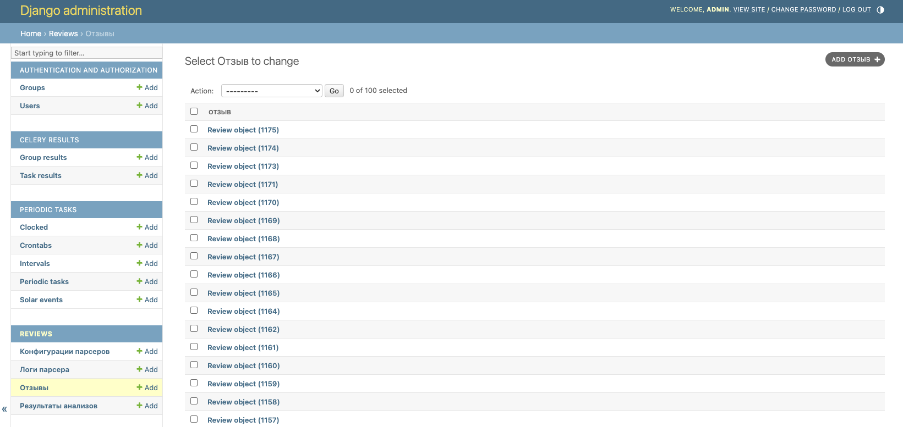
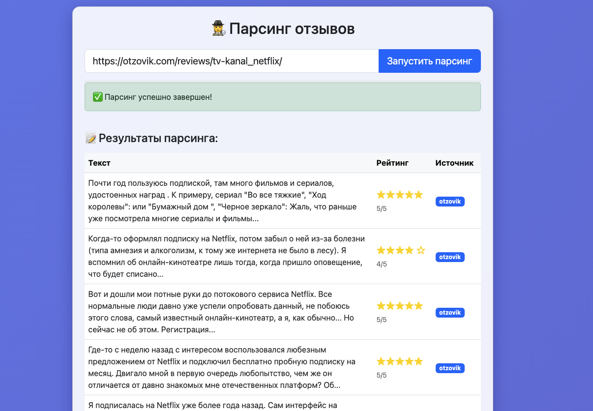
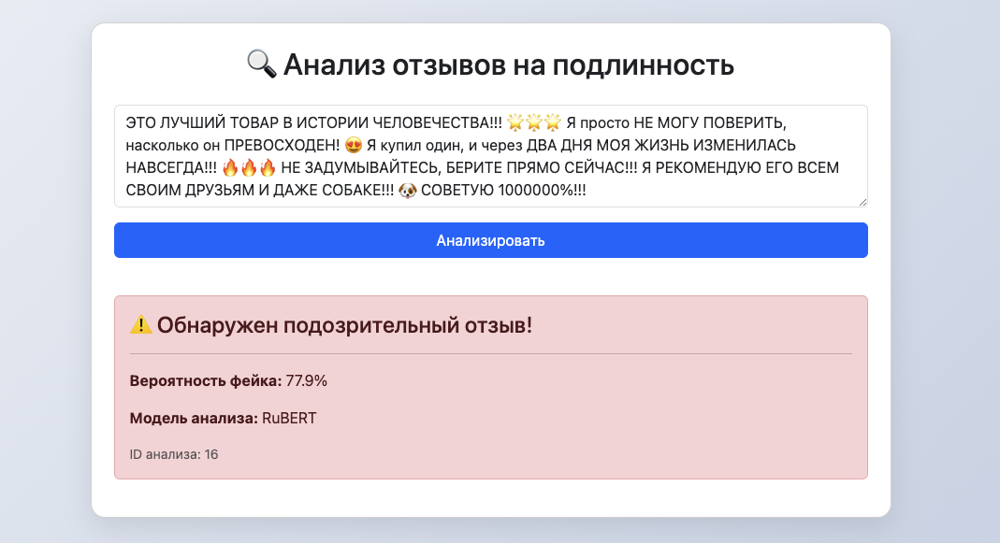
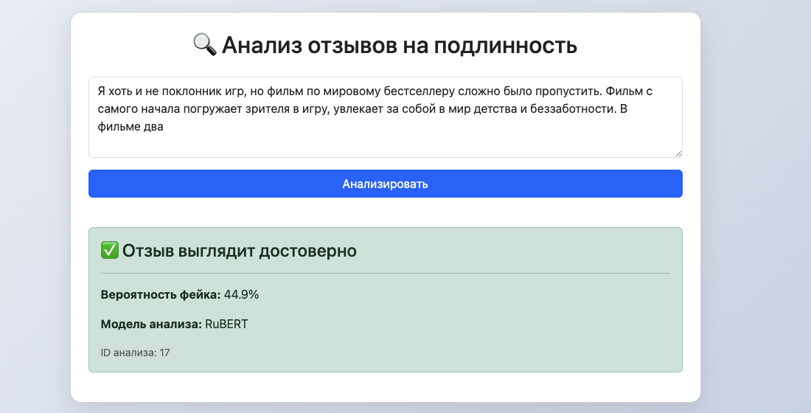

# 🕵️‍♂️ Fake Reviews Detector

## 📌 Описание проекта

**Fake Reviews Detector** — это веб-приложение для автоматического анализа и определения фейковых отзывов. Система сочетает классические паттерны (спам, CAPS LOCK, эмоции) и мощную NLP-модель **RuBERT**, обученную распознавать подозрительные тексты.

📌 **Что делает проект:**
- Принимает отзыв пользователя
- Анализирует текст (эмоциональность, спам, форматирование и т.д.)
- Применяет модель RuBERT для классификации: `фейк / не фейк`
- Сохраняет результат анализа в базу данных
- Отображает результат в админке Django и через API
- Может собирать отзывы с помощью ScraperAPI (при наличии ключа)
- Может дообучить модель RuBERT на основе собраных отзывов (при перенастройке)

## 🧰 Стек технологий

| Компонент         | Технология                             |
|-------------------|----------------------------------------|
| Backend           | Django, Django REST Framework          |
| База данных       | PostgreSQL                             |
| Асинхронность     | Celery + Redis                         |
| NLP-модель        | RuBERT (Transformers + PyTorch)        |
| Парсинг (опцион.) | Scrapy + ScraperAPI                    |
| Интерфейс         | HTML / CSS / JS + Bootstrap            |
| Контейнеризация   | Docker, Docker Compose                 |

---

## 🚀 Быстрый старт

### 📦 Зависимости:
- Docker
- Docker Compose
- Docker Desktop

### 🧪 Развернуть проект локально:

1. Клонируй репозиторий:
```bash
git clone https://github.com/yourusername/fake-reviews-detector.git
cd fake-reviews-detector
```

2. Создай `.env` файл с настройками:
```
# ScraperAPI
SCRAPERAPI_KEY=твой_ключ

# Обязательные для БД
DB_USER=your_user
DB_PASSWORD=your_password
DB_NAME=your_db

# Для Django
DB_HOST=db
DB_PORT=5432
SECRET_KEY=твой_секретный_ключ
DEBUG=True

# Superuser
DJANGO_SUPERUSER_USERNAME=admin
DJANGO_SUPERUSER_EMAIL=admin@example.com
DJANGO_SUPERUSER_PASSWORD=admin
```

3. Запусти проект:
```bash
docker compose build --no-cache
```

4. Создай суперпользователя:
```bash
docker-compose exec web python manage.py createsuperuser
```
или заранее заполни данные в `.env`.

5. Открой в браузере:
- Админка: http://localhost:8000/admin  

- Парсер: http://localhost:8000/parse/  

- Проверка отзыва: http://localhost:8000/check/  


---

## ⚙️ Основные команды

| Действие                       | Команда                                                               |
|--------------------------------|-----------------------------------------------------------------------|
| Запуск проекта                 | `docker-compose up -d`                                                |
| Миграции                       | `docker-compose exec web python manage.py migrate`                    |
| Создать суперюзера             | `docker-compose exec web python manage.py createsuperuser`            |
| Обучение модели                | `docker-compose exec web python scripts/train_model.py`               |
| Celery задачи (анализ отзывов) | Настраивается автоматически через Celery Beat                         |

---

## ⚠️ Статус проекта

🔧 Проект находится в разработке. Что ещё предстоит сделать:
- 🎨 Улучшить веб-интерфейс (добавить навигацию, стили Bootstrap)
- 👨‍💻 Улучшить интерфейс админки